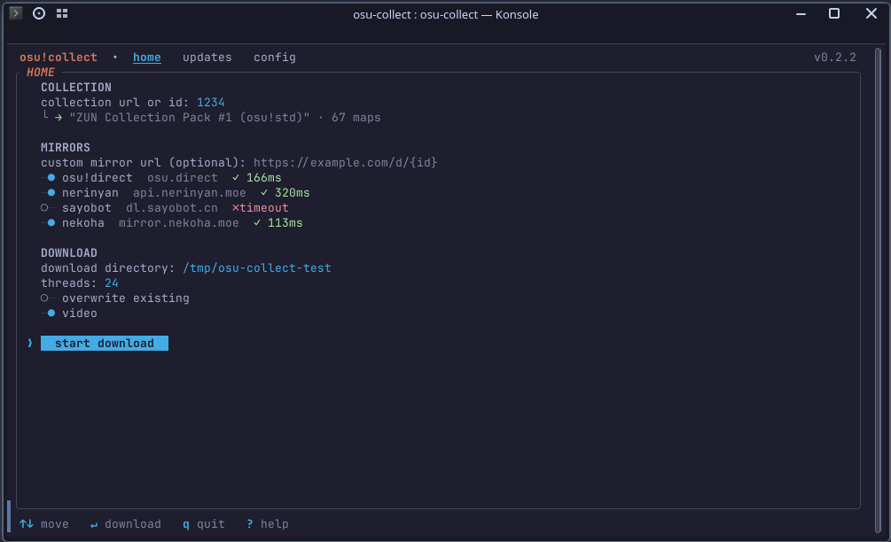
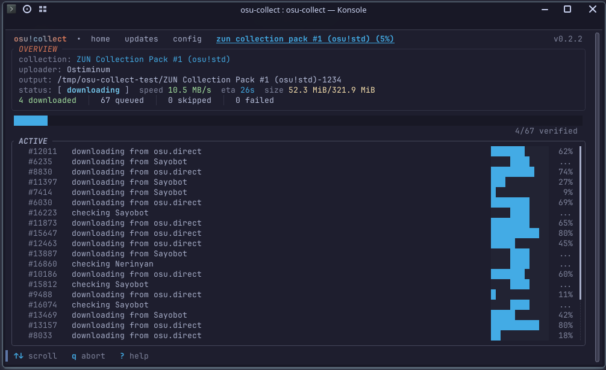

<h1></h1>

<b>Free osu!collector downloader </b>

[Features](#features) 

osu!collect is a terminal app that **downloads osu! beatmap collections from [osu!collector](https://osucollector.com)**. Paste a collection link, pick a folder, and every map batch-downloads using multiple mirrors in rotation with automatic failover. You also get a ready-to-import `collection.db` and ability to update the collections later.

## Features

- **Free, no account needed,** whereas the official osu!Collector app is paid.
- **Nine mirrors with automatic failover:** osu!collect keeps downloading even when a few mirrors are throttled. See [Mechanics](https://github.com/uwuclxdy/osu-collect/wiki/Mirrors).
- **Search for maps without a collection:** per-diff criteria, auto-routed between the osu! api and nzbasic's community database. See [Criteria](https://github.com/uwuclxdy/osu-collect/wiki/Finding-Maps).
- **A real osu! collection, verified:** integrity-checked `collection.db`, ready to import directly into your preferred osu! client. See [Verification](https://github.com/uwuclxdy/osu-collect/wiki/Usage).
- **Keep collections up to date:** re-check a downloaded collection later, download only new or missing beatmaps. See [Guide](https://github.com/uwuclxdy/osu-collect/wiki/Updating-Collections).

